---
title: Girls in the Game
level: Scratch 1
language: en-GB
stylesheet: scratch
embeds: "*.png"
materials: ["Club Leader Resources/*"]
...

# Introduction { .intro }

You are going to learn how to program your own animation!

  <iframe allowtransparency="true" width="485" height="402" src="http://scratch.mit.edu/projects/embed/95843402/?autostart=false" frameborder="0"></iframe>
  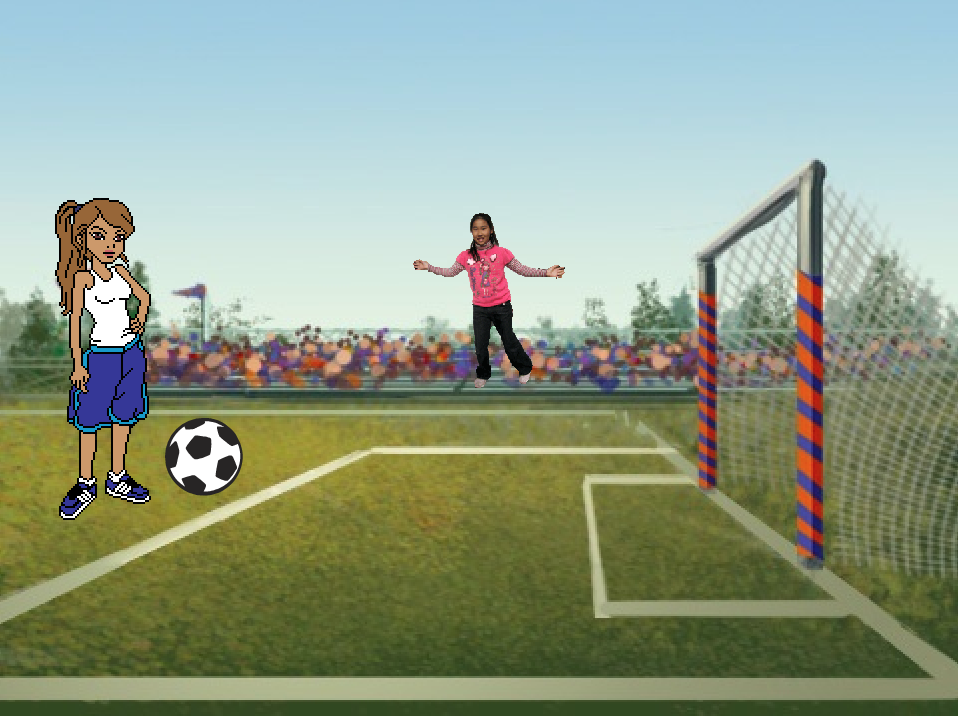

# Step 1: Sprites { .activity .new-page}

Before you can start coding, you’ll need to add in a ‘thing’ to code. In Scratch, these ‘things’ are called __sprites__.

## Activity Checklist { .check }

+ First, open up the Scratch editor. You can find the online Scratch editor at <a href="http://jumpto.cc/scratch-new">jumpto.cc/scratch-new</a>. It looks like this:

	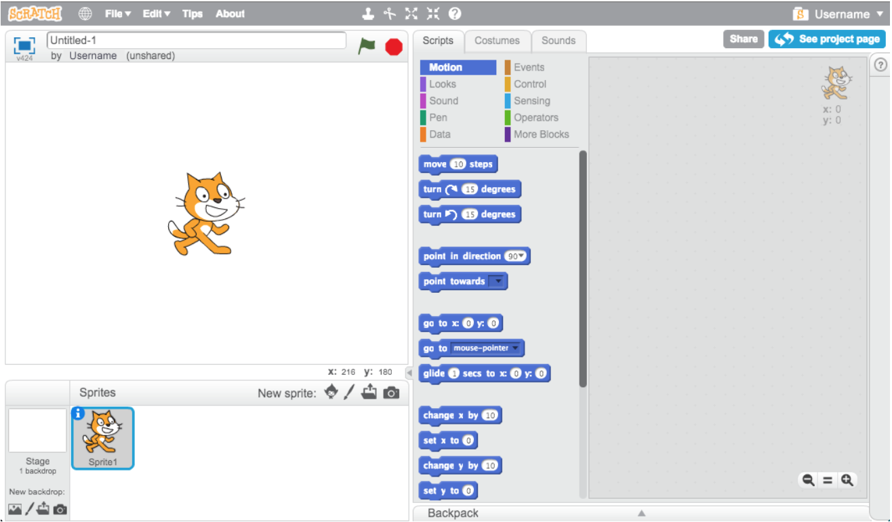

+ The cat sprite that you can see is the Scratch mascot. Let’s get rid of it, by right-clicking and then clicking ‘delete’.

	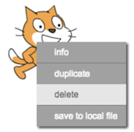

+ Next, locate the ‘New sprite’ icons. Click ‘Choose sprite from library’ to open up a list of all the Scratch sprites.

	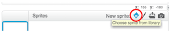

+ Search until you see a sprite called ‘Adrian’. Click on her and click ‘OK’ to add her to your project.

	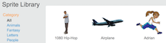

## Challenge: Adding another sprite {.challenge}
Can you add the sprite ‘Soccer Ball’ to your project?

## Activity Checklist { .check }

You’ll notice the Soccer Ball is too big. You can resize sprites by clicking on the ‘shrink’ icon then clicking on the sprite you want to change. 

	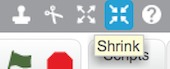

## Save your project { .save }

Give your program a name, by typing one into the text box in the top-left corner.

You can then click ‘File’ and then ‘Save now’ to save your project.

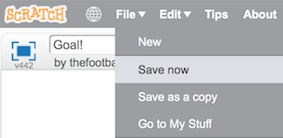

# Step 2: The Stage { .activity .new-page }

The stage is the area on the left, and is where your project comes to life. Think of it as a performance area, just like a real stage! 

## Activity Checklist { .check }

+ At the moment, the stage is white, and looks pretty boring! Let’s add a backdrop to the stage, by clicking ‘Choose backdrop from library’.

	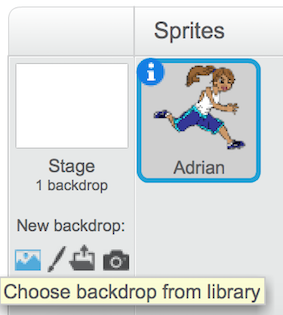

+ Click ‘Outdoors’ on the left and then click on a goal backdrop and click ‘OK’.

	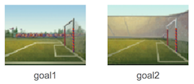

	Your stage should now look like this:

	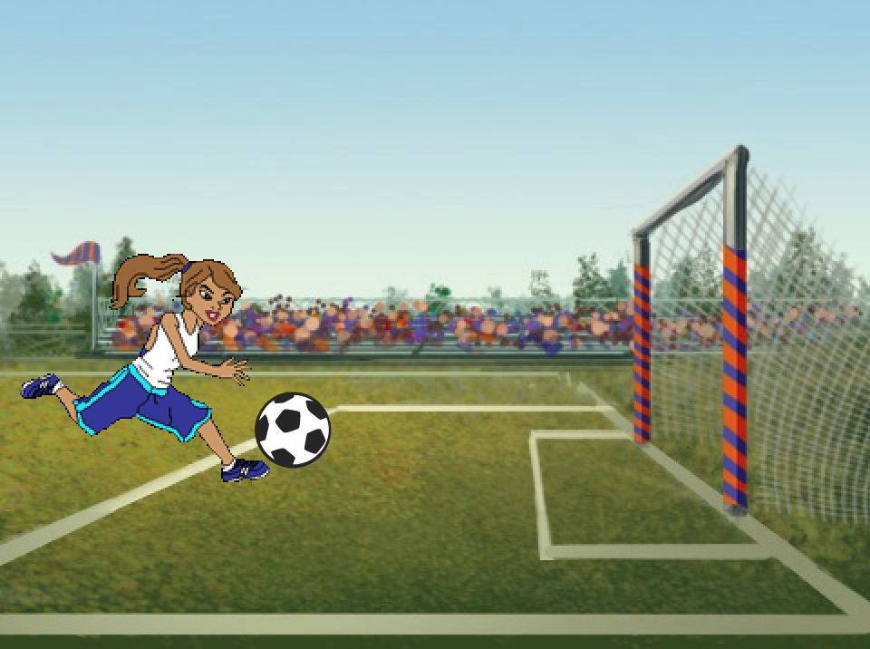

# Step 3: Animating your footballer { .activity .new-page }

Let’s code Adrian to kick the Soccer Ball. 

## Activity Checklist { .check }

+ To make Adrian look like she is kicking the ball we need two of her costumes. Click on Adrian, then on her ‘Costumes’ tab, and you’ll see 3 costumes.

	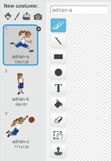

+ The names of the costumes aren’t very helpful at the moment. Rename ‘adrian-a’ to ‘kicking’ and ‘adrian-b’ to ‘standing’ by typing the new name of each costume into the text box. 

	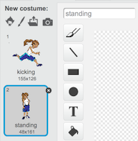

+ Now we need to add some code. You can find the code blocks in the ‘Scripts’ tab, and they are all colour-coded! Drag these blocks into the code area to the right, making sure that they are connected together (like Lego blocks):

	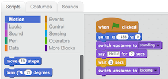

## Save your project { .save }

# Step 4: Moving the ball { .activity .new-page }

When Adrian has kicked, you need to `broadcast` {.blockevents} a message to the soccer ball sprite, telling it to move.

## Activity Checklist { .check }

+ To do this, first add this block to the end of your code.

	

To create the `broadcast` {.blockevents} block, click the down arrow and select ‘new message…’.
You can then type ‘kick’ to create your new message.

	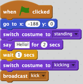

+ You now need to tell your soccer ball sprite where to start and what to do when it receives the message. Click on your soccer ball sprite and add this code. 

	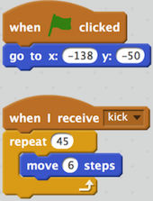

The `repeat` {.blockcontrol} block is used to repeat something lots of times, and is also known as a __loop__. 

+ Click on the flag to see your new animation. 

# Step 5: Some fans { .activity .new-page }

Now we’re going to add some fans to cheer when Adrian kicks the ball into the net. 

## Activity Checklist { .check }

+ Let’s add a new sprite called ‘Anna’ from the library. Anna has 2 costumes, we’ll use them both to make it look like she’s cheering when a goal is scored.

	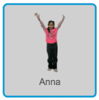

## Challenge: Preparing to animate {.challenge}
Can you rename Anna’s costumes to arms-side and arms-up to make them more obvious?
If Anna is a bit too big, can you use the shrink tool to resize her. 

## Activity Checklist { .check }

+ To make sure Anna cheers at the right time, we need to add an extra block onto the end of our Soccer Ball script to `broadcast` {.blockevents} a message when a goal is scored.

	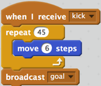

+ Next, click on Anna and add these code blocks.

	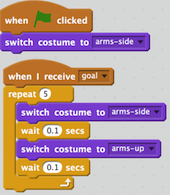

+ Click on the flag to see your animation. 

## Save your project { .save }

## Challenge: Expanding your animation {.challenge}
Can you personalise the footballer? Perhaps change her hair colour or kit.

Can you add some more fans to your project?

Can you make the fans say encouraging words?

Can you add some sounds to your project?

## Save your project { .save }
